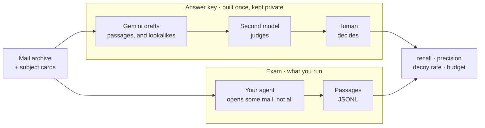

# DSAR-Bench

A benchmark for GDPR Article 15 subject access requests over a real archive:
given a person, find every passage that is their personal data — including the
passages that never say their name.

Existing privacy benchmarks measure agents **leaking** data they should have
withheld. This one measures the opposite failure: not returning data a person
is legally entitled to receive.

The agent gets the whole corpus and the subject cards. It must tag personal
data. It must not win by reading everything. That restraint is the number you
would trust at two million emails.

This repository is the evaluation package. It is not an agent. Official
scoring is private. The answer key is not in this repository.



Start on the Sallow practice set below: same rules, fictional people, and
you can score it on your own machine. The official exam is a different
archive with a closed key, scored on our side.

## The exam

Four numbers, none sufficient alone:

| metric | what it asks |
|---|---|
| recall | did you find the closed-key YESes, including the unnamed ones |
| precision | are the passages you returned actually in the key |
| decoy rate | did you hand over passages marked NO (wrong person, expired role) |
| budget | how many emails you opened, characters you read, tool calls you made |

Greedy is high recall, a fat budget, and sloppy precision. Selective is
recall on the hard slice, precision that holds, and a budget that stays
almost flat as the archive grows. An agent that opens every message to beat
grep has not done the task.

Name search is the keyword floor, not the exam. Cautious and greedy modes
live in `baselines/name_search.py`. Full spec in [docs/TASK.md](docs/TASK.md).

## Practice set (Sallow FM)

A rewritten community-radio archive you can score locally. Names, events,
and organisation are not the official test. Same Nowak rules, same
submission format.

```
python3 dsarbench/score.py runs/my_agent.jsonl --dev dist/sallow
```

24 emails in 6 threads (one incident each, people quoting each other),
49 labelled passages, ten fictional volunteers. Official scoring stays
private and uses a different corpus.

Keyword floor on this set (not the official exam):

```
python3 baselines/name_search.py --mode cautious \
  --corpus dist/sallow/corpus.jsonl \
  --subjects-file dist/sallow/subjects.json \
  --out runs/sallow_name_search_cautious.jsonl
python3 dsarbench/score.py runs/sallow_name_search_cautious.jsonl --dev dist/sallow
```

Cautious 46.3% recall / 40.4% precision; greedy 48.8% / 40.0%. Named
passages 95%; unnamed 0–5%; T7 authorship almost untouched. The two
decoys are an expired role title.

## How the official key was made

The practice set is a rewritten slice of this key, not a second labelling
of the real archive.

**Gemini drafts.** Every email is read once for every subject at the same
time, and roles are read as of that message's date. It proposes passages
that are the subject's personal data, and passages that only look like
them — a namesake, or a job title that belonged to someone else at the
time.

**A second model judges.** It votes on every span the first pass did not
find. Where the two still disagree, a third call decides without being
told which model said what.

**A human decides.** One question per proposed span: is this this
person's personal data? That mark is the key.

### What deciding actually looks like

Adjudication runs in a local-only interface that reads the key off disk
and uploads nothing. Each item is one highlighted passage shown in the
email it came from, with the subject's aliases and the people they are
not to be confused with:


The brief is deliberate about what "no" means. Roughly a tenth of the
items are lookalikes — passages that resemble the subject but belong to
a namesake — so rejecting one is a recorded answer rather than a skip:


Order is enforced by the server, not the page. The endpoint serving an
item never carries the model's verdict, tier or rationale; the reveal
endpoint returns them only once a human mark for that item is already on
disk. An adjudicator shown the answer first is being asked to agree, and
agreement measured that way says nothing about whether the key is right.
Afterwards both drafts and any disagreement are shown in full:


A helper agent answers questions about the thread — who someone is, what
a role means, what happened earlier in an argument. It receives the
thread and the subject brief but never the label, so it cannot leak the
answer it is standing beside:


Two things follow. Considering every subject on every mail is what
produces the lookalikes — a pass scoped to one name almost never has
occasion to say no. And the human corrects a draft rather than labelling
from scratch, so this is not a claim that a model and a human
independently agreed.

## Official exam

A submission is JSONL, one returned passage per line:

```json
{"subject_id": "S1", "doc_id": "dp-2024-01-00001-00000000", "text": "verbatim quote"}
```

Quote the passage verbatim; the harness anchors it to the corpus. Official
scores are computed on our side. The real corpus is rebuilt rather than
distributed — `fetch_debian.py`, then `parse.py`, then
`build_inputs.py --verify` against `dist/corpus_manifest.json`.

## Layout

```
dsarbench/harness/    scoring library; offline, deterministic, no model calls
dsarbench/score.py    score a submission (needs a local key)
baselines/            keyword floors, emitted as ordinary submissions
docs/                 task spec, provenance, related work
dist/sallow/          practice set (rewritten; locally scorable)
dist/                 official task card and corpus manifest
```

## Documentation

| | |
|---|---|
| [docs/TASK.md](docs/TASK.md) | the task and submission format |
| [docs/STATS.md](docs/STATS.md) | corpus statistics |
| [docs/RELATED_WORK.md](docs/RELATED_WORK.md) | prior work, and what here is new |
| [docs/PROVENANCE.md](docs/PROVENANCE.md) | source, terms, fetch date, consent posture |

## Conventions

All `span` offsets are Python character indices into the decoded `text` of
the referenced `block_id`. Never into `body_raw`, never byte offsets.

## Data handling

The corpus and the answer key do not ship. They describe named living
people, and assembling per-person dossiers is a different act from the
source archive being public. See [docs/PROVENANCE.md](docs/PROVENANCE.md).
