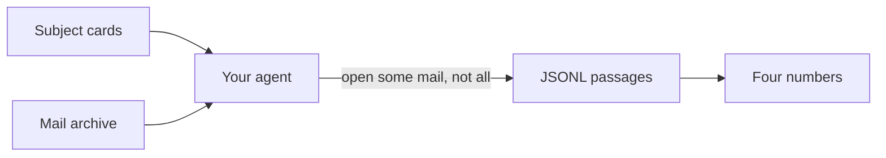
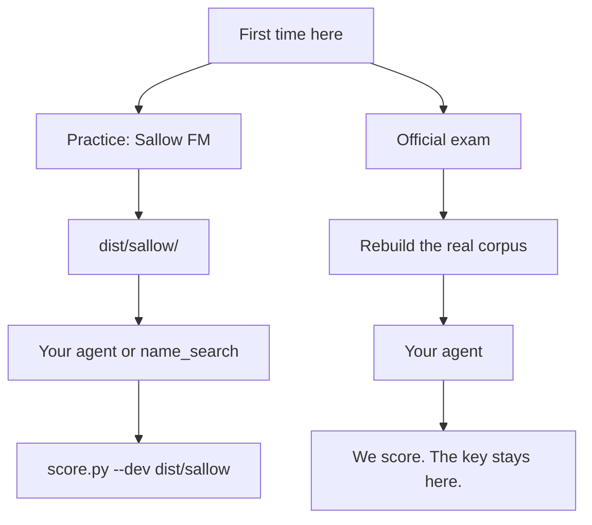
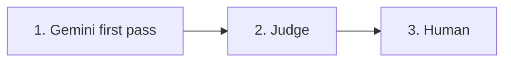

# DSAR-Bench

A benchmark for GDPR Article 15 subject access requests over a real archive:
given a person, find every passage that is their personal data — including the
passages that never say their name.

Existing privacy benchmarks measure agents **leaking** data they should have
withheld. This one measures the opposite failure: not returning data a person
is legally entitled to receive.

The agent gets the whole corpus and the subject cards. It must tag personal
data. It must not win by reading everything. That restraint is the number you
would trust at two million emails.

This repository is the evaluation package. It is not an agent. Official
scoring is private. The answer key is not in this repository.



The four numbers: **recall** (did you find their data, including unnamed
passages), **precision** (is what you returned actually theirs), **decoy
rate** (did you hand over a namesake or an expired role), **budget** (how
much you opened). None is enough alone. Grep is the floor, not the exam.

Two ways in:



Start on Sallow. Same rules, fictional people, you can score on your
machine. The official archive is a different corpus and a closed key.

## The exam

Four numbers, none sufficient alone:

| metric | what it asks |
|---|---|
| recall | did you find the closed-key YESes, including the unnamed ones |
| precision | are the passages you returned actually in the key |
| decoy rate | did you hand over passages marked NO (wrong person, expired role) |
| budget | how many emails you opened, characters you read, tool calls you made |

Greedy is high recall, a fat budget, and sloppy precision. Selective is
recall on the hard slice, precision that holds, and a budget that stays
almost flat as the archive grows. An agent that opens every message to beat
grep has not done the task.

Name search is the keyword floor, not the exam. Cautious and greedy modes
live in `baselines/name_search.py`. Full spec in [docs/TASK.md](docs/TASK.md).

## Practice set (Sallow FM)

A rewritten community-radio archive you can score locally. Names, events,
and organisation are not the official test. Same Nowak rules, same
submission format.

```
python3 dsarbench/score.py runs/my_agent.jsonl --dev dist/sallow
```

24 emails in 6 threads (one incident each, people quoting each other),
49 labelled passages, ten fictional volunteers. Official scoring stays
private and uses a different corpus.

Keyword floor on this set (not the official exam):

```
python3 baselines/name_search.py --mode cautious \
  --corpus dist/sallow/corpus.jsonl \
  --subjects-file dist/sallow/subjects.json \
  --out runs/sallow_name_search_cautious.jsonl
python3 dsarbench/score.py runs/sallow_name_search_cautious.jsonl --dev dist/sallow
```

Cautious 46.3% recall / 40.4% precision; greedy 48.8% / 40.0%. Named
passages 95%; unnamed 0–5%; T7 authorship almost untouched. The two
decoys are an expired role title.

## How the official key was made

Three steps. The machine proposes. Another model judges. A human decides.
The practice set is a rewritten slice of that human key, not a second
labelling of the real archive.



1. **Gemini** reads every mail for every subject and proposes passages
   (theirs, or a lookalike that is not).
2. **Judge** — a second model votes on each proposal. Disagreements get
   a third call.
3. **Human** — one question: is this this person's data? That mark is
   gold. The key is closed and not in this repo.

Review corrects a draft. It is not "the model and the human agreed."

## Official exam

A submission is JSONL, one returned passage per line:

```json
{"subject_id": "S1", "doc_id": "dp-2024-01-00001-00000000", "text": "verbatim quote"}
```

Quote the passage verbatim; the harness anchors it to the corpus. Official
scores are computed on our side. The real corpus is rebuilt rather than
distributed — `fetch_debian.py`, then `parse.py`, then
`build_inputs.py --verify` against `dist/corpus_manifest.json`.

## Layout

```
dsarbench/harness/    scoring library; offline, deterministic, no model calls
dsarbench/score.py    score a submission (needs a local key)
baselines/            keyword floors, emitted as ordinary submissions
docs/                 task spec, provenance, related work
dist/sallow/          practice set (rewritten; locally scorable)
dist/                 official task card and corpus manifest
```

## Documentation

| | |
|---|---|
| [docs/TASK.md](docs/TASK.md) | the task and submission format |
| [docs/STATS.md](docs/STATS.md) | corpus statistics |
| [docs/RELATED_WORK.md](docs/RELATED_WORK.md) | prior work, and what here is new |
| [docs/PROVENANCE.md](docs/PROVENANCE.md) | source, terms, fetch date, consent posture |

## Conventions

All `span` offsets are Python character indices into the decoded `text` of
the referenced `block_id`. Never into `body_raw`, never byte offsets.

## Data handling

The corpus and the answer key do not ship. They describe named living
people, and assembling per-person dossiers is a different act from the
source archive being public. See [docs/PROVENANCE.md](docs/PROVENANCE.md).
